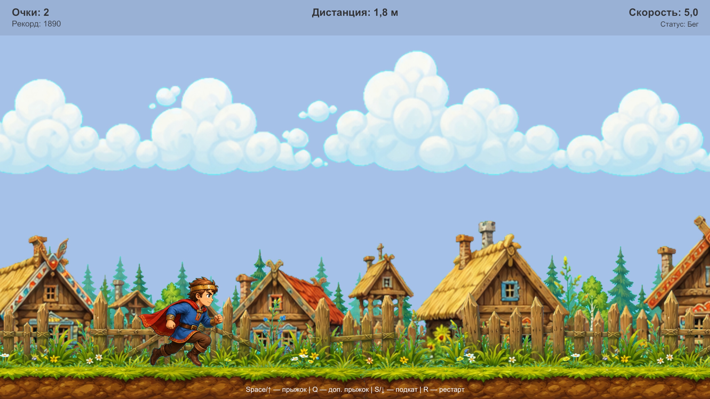

# RusRunner — 2D-автораннер на Unity

**RusRunner** — учебный программный комплекс казуальной 2D-игры в жанре линейного автораннера, разработанный в рамках комплексного дипломного проекта на тему: **«Проектирование, оптимизация и реализация программного комплекса казуальной 2D-игры на основе жанра линейного автораннера»**.

Игрок управляет персонажем, который визуально движется вперёд за счёт смещения игрового мира. Основная задача — преодолевать препятствия, использовать прыжок, дополнительный прыжок и подкат, собирать бонусы, увеличивать дистанцию и улучшать личный рекорд.



## Основные возможности

- линейный 2D-автораннер с короткими игровыми сессиями;
- главное меню, настройки, HUD и экран поражения;
- управление персонажем: прыжок, дополнительный прыжок и подкат;
- препятствия разных типов: наземные, воздушные и препятствия для подката;
- бонусы временного действия: щит, ускорение и удвоение очков;
- система очков, дистанции, скорости и сохранения рекорда;
- постепенный рост скорости и сложности;
- генерация бесконечной трассы;
- повторное использование объектов через object pooling;
- локальное сохранение настроек громкости, FPS и лучшего результата.

## Стек технологий

| Технология / инструмент | Назначение |
| --- | --- |
| **Unity 6000.0.43f1** | игровой движок и среда разработки |
| **C#** | реализация игровой логики и модульного ядра |
| **Unity 2D Physics** | обработка движения, коллизий, прыжка и подката |
| **Universal Render Pipeline 17.0.4** | рендеринг 2D-сцены |
| **uGUI 2.0.0** | главное меню, настройки, HUD и экран Game Over |
| **Input System 1.13.1** | подключенный пакет для развития системы ввода |
| **PlayerPrefs** | локальное сохранение настроек и рекорда |
| **Resources** | загрузка графических и звуковых ресурсов |
| **Git / GitHub** | хранение исходного кода и версионный контроль |

## Структура проекта

```text
Assets/
├── Scenes/
│   ├── RunnerScene.unity        # основная игровая сцена
│   └── SampleScene.unity        # стандартная сцена Unity
├── Scripts/
│   ├── Core/                    # состояние игры, настройки, системы ядра
│   └── Game/                    # ввод, бонусы, способности, представление, аудио
├── Resources/
│   ├── Art/                     # спрайты персонажа, фона, препятствий и бонусов
│   └── Audio/                   # музыка и звуковые эффекты
├── RunnerBootstrap.cs           # координатор игрового цикла
├── RunnerController.cs          # управление персонажем
├── TrackGenerator.cs            # генерация трассы, препятствий и бонусов
├── MainMenuController.cs        # главное меню и настройки
└── HudController.cs             # HUD и экран поражения

Packages/
└── manifest.json                # зависимости Unity-проекта

ProjectSettings/
└── ProjectVersion.txt           # версия Unity Editor
```

## Требования

Для запуска проекта из исходников необходимо установить:

- **Unity Hub**;
- **Unity Editor 6000.0.43f1** или совместимую версию Unity 6;
- модуль сборки под нужную платформу, например **Windows Build Support**, **macOS Build Support**, **Linux Build Support** или **WebGL Build Support**;
- IDE для C# — Visual Studio, JetBrains Rider или Visual Studio Code с расширениями для Unity.

> Рекомендуется открывать проект именно в версии Unity **6000.0.43f1**, так как она указана в `ProjectSettings/ProjectVersion.txt`.

## Запуск проекта

Скачайте из релиза один из архивов с игрой в соответствии со своей операционной системой:

1. RusRunner_Win.zip.
2. RusRunner_MacOS.tar.gz.
3. RusRunner_Linux.tar.

Разархивируйте архив. Если у вас MacOS, установить и запустить игру.

Если у вас Windows, запустить из распакованного архива исполняющий файл **My project.exe**


## Установка и запуск проекта из исходника

### 1. Клонирование репозитория

```bash
git clone https://github.com/Bigryb/Diplom_2D_Autorunner
cd <repository>
```

Если проект скачан архивом, распакуйте его и откройте папку, в которой находятся каталоги `Assets`, `Packages` и `ProjectSettings`.

### 2. Открытие в Unity

1. Запустите **Unity Hub**.
2. Нажмите **Add / Add project from disk**.
3. Выберите корневую папку проекта.
4. Откройте проект через Unity **6000.0.43f1**.
5. Дождитесь завершения импорта ассетов и восстановления пакетов.

### 3. Запуск игровой сцены

1. В окне **Project** откройте сцену:

```text
Assets/Scenes/RunnerScene.unity
```

2. Нажмите кнопку **Play** в Unity Editor.
3. В главном меню игры нажмите **Начать игру**.

## Управление

| Клавиша | Действие |
| --- | --- |
| `Space` или `↑` | обычный прыжок |
| `Q` | дополнительный прыжок в воздухе |
| `S` или `↓` | подкат |
| `R` | повторный запуск после поражения |
| Мышь | выбор пунктов меню и настроек |

## Настройки игры

В главном меню доступен экран настроек, где можно изменить:

- громкость музыки;
- громкость звуковых эффектов;
- целевую частоту кадров: **60**, **120** или **180 FPS**.

Настройки и лучший результат сохраняются локально через `PlayerPrefs`.

## Сборка проекта

Перед созданием сборки рекомендуется проверить список сцен:

1. Откройте **File → Build Profiles** или **File → Build Settings**.
2. Добавьте сцену `Assets/Scenes/RunnerScene.unity` в список сцен сборки.
3. При необходимости удалите `SampleScene.unity` из списка, если она не используется.
4. Выберите целевую платформу.
5. Нажмите **Switch Platform**.
6. Нажмите **Build** или **Build And Run**.

## Тестирование через Unity Test Framework

### Запуск через Unity

1. Откройте проект `RusRunner` через Unity Hub.
2. Дождитесь окончания компиляции скриптов.
3. Откройте окно `Window -> General -> Test Runner`.
4. Перейдите на вкладку `EditMode`.
5. Нажмите `Run All`.

### Запуск из командной строки

Пример для macOS/Linux:

```bash
/Applications/Unity/Hub/Editor/6000.0.43f1/Unity.app/Contents/MacOS/Unity \
  -batchmode \
  -projectPath "RusRunner" \
  -runTests \
  -testPlatform EditMode \
  -testResults "TestResults.xml" \
  -quit
```

Пример для Windows:

```bat
"C:\Program Files\Unity\Hub\Editor\6000.0.43f1\Editor\Unity.exe" ^
  -batchmode ^
  -projectPath "RusRunner" ^
  -runTests ^
  -testPlatform EditMode ^
  -testResults "TestResults.xml" ^
  -quit
```


## Архитектурная идея

Проект построен по компонентно-модульному принципу. Центральным координатором выступает `RunnerBootstrap`, который связывает состояние игры, управление персонажем, генератор трассы, систему прогрессии, систему очков, бонусы и интерфейс.

Основное состояние текущего забега хранится в `GameContext`. За отдельные части логики отвечают самостоятельные системы:

- `ProgressionSystem` — рост скорости и сложности;
- `ScoreSystem` — очки, дистанция и рекорд;
- `PowerUpSystem` — временные бонусы;
- `RunnerController` — физика персонажа;
- `TrackGenerator` — генерация и прокрутка трассы.

Такое разделение упрощает изменение баланса, добавление новых бонусов, препятствий и способов управления.

## Статус проекта

Проект является учебной дипломной разработкой и может использоваться как основа для дальнейшего развития 2D-автораннера: добавления новых уровней, визуальных тем, расширенной системы бонусов, мобильного управления, таблицы рекордов и автоматизированных тестов.
